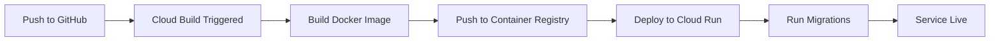

# 🚀 GitHub to Cloud Run Deployment Guide (MySQL)

Complete guide for deploying Portfolio Tracker API to Google Cloud Run from GitHub with MySQL database.

---

## 📋 Prerequisites

- Google Cloud Account with billing enabled
- GitHub repository with your code
- Google Cloud SDK (gcloud CLI) installed

---

## 🎯 Quick Deploy in 6 Steps

### **Step 1: Set Up Google Cloud Project**

```bash
# Install gcloud CLI if not installed
# https://cloud.google.com/sdk/docs/install

# Login and create project
gcloud auth login
gcloud projects create YOUR_PROJECT_ID --name="Portfolio Tracker"
gcloud config set project YOUR_PROJECT_ID

# Enable required APIs
gcloud services enable cloudbuild.googleapis.com
gcloud services enable run.googleapis.com
gcloud services enable containerregistry.googleapis.com
gcloud services enable sqladmin.googleapis.com
gcloud services enable secretmanager.googleapis.com
```

---

### **Step 2: Create Cloud SQL MySQL Database**

#### Using Google Cloud Console (Recommended):

1. Go to: https://console.cloud.google.com/sql/instances
2. Click **"CREATE INSTANCE"**
3. Select **"MySQL"**
4. Configure:
   - **Instance ID**: `portfolio-tracker-mysql`
   - **Password**: Set a strong password (save it!)
   - **Database version**: MySQL 8.0
   - **Region**: `asia-southeast1` (Singapore)
   - **Machine type**: `db-f1-micro` (free tier eligible) or `db-n1-standard-1`
   - **Storage**: 10 GB SSD
5. Click **"CREATE INSTANCE"** (takes ~5-10 minutes)

#### Using gcloud CLI:

```bash
# Create MySQL instance
gcloud sql instances create portfolio-tracker-mysql \
    --database-version=MYSQL_8_0 \
    --tier=db-f1-micro \
    --region=asia-southeast1 \
    --root-password=YOUR_STRONG_PASSWORD

# Create database
gcloud sql databases create portfolio_tracker \
    --instance=portfolio-tracker-mysql

# Get connection name (save this!)
gcloud sql instances describe portfolio-tracker-mysql \
    --format='value(connectionName)'
# Output: YOUR_PROJECT_ID:asia-southeast1:portfolio-tracker-mysql
```

---

### **Step 3: Configure Database Connection Strings**

For **MySQL with Cloud Run**, use Unix socket connection:

```bash
# For AsyncIO (aiomysql)
DATABASE_URL="mysql+aiomysql://root:YOUR_PASSWORD@/portfolio_tracker?unix_socket=/cloudsql/YOUR_PROJECT_ID:asia-southeast1:portfolio-tracker-mysql"

# For Sync operations
SYNC_DATABASE_URL="mysql+pymysql://root:YOUR_PASSWORD@/portfolio_tracker?unix_socket=/cloudsql/YOUR_PROJECT_ID:asia-southeast1:portfolio-tracker-mysql"
```

**Replace:**
- `YOUR_PASSWORD` - Your MySQL root password
- `YOUR_PROJECT_ID` - Your Google Cloud project ID

---

### **Step 4: Create Secrets in Secret Manager**

```bash
# Generate a strong SECRET_KEY
python -c "import secrets; print(secrets.token_urlsafe(32))"

# Create secrets
echo -n "mysql+aiomysql://root:YOUR_PASSWORD@/portfolio_tracker?unix_socket=/cloudsql/YOUR_PROJECT_ID:asia-southeast1:portfolio-tracker-mysql" | \
  gcloud secrets create DATABASE_URL --data-file=-

echo -n "mysql+pymysql://root:YOUR_PASSWORD@/portfolio_tracker?unix_socket=/cloudsql/YOUR_PROJECT_ID:asia-southeast1:portfolio-tracker-mysql" | \
  gcloud secrets create SYNC_DATABASE_URL --data-file=-

echo -n "YOUR_GENERATED_SECRET_KEY" | \
  gcloud secrets create SECRET_KEY --data-file=-

echo -n "YOUR_GMAIL_APP_PASSWORD" | \
  gcloud secrets create SMTP_PASSWORD --data-file=-

# Grant Cloud Build access to secrets
PROJECT_NUMBER=$(gcloud projects describe YOUR_PROJECT_ID --format='value(projectNumber)')

gcloud secrets add-iam-policy-binding DATABASE_URL \
  --member=serviceAccount:${PROJECT_NUMBER}@cloudbuild.gserviceaccount.com \
  --role=roles/secretmanager.secretAccessor

gcloud secrets add-iam-policy-binding SYNC_DATABASE_URL \
  --member=serviceAccount:${PROJECT_NUMBER}@cloudbuild.gserviceaccount.com \
  --role=roles/secretmanager.secretAccessor

gcloud secrets add-iam-policy-binding SECRET_KEY \
  --member=serviceAccount:${PROJECT_NUMBER}@cloudbuild.gserviceaccount.com \
  --role=roles/secretmanager.secretAccessor

gcloud secrets add-iam-policy-binding SMTP_PASSWORD \
  --member=serviceAccount:${PROJECT_NUMBER}@cloudbuild.gserviceaccount.com \
  --role=roles/secretmanager.secretAccessor

# Grant Cloud Run access to secrets
gcloud secrets add-iam-policy-binding DATABASE_URL \
  --member=serviceAccount:${PROJECT_NUMBER}-compute@developer.gserviceaccount.com \
  --role=roles/secretmanager.secretAccessor

gcloud secrets add-iam-policy-binding SYNC_DATABASE_URL \
  --member=serviceAccount:${PROJECT_NUMBER}-compute@developer.gserviceaccount.com \
  --role=roles/secretmanager.secretAccessor

gcloud secrets add-iam-policy-binding SECRET_KEY \
  --member=serviceAccount:${PROJECT_NUMBER}-compute@developer.gserviceaccount.com \
  --role=roles/secretmanager.secretAccessor

gcloud secrets add-iam-policy-binding SMTP_PASSWORD \
  --member=serviceAccount:${PROJECT_NUMBER}-compute@developer.gserviceaccount.com \
  --role=roles/secretmanager.secretAccessor
```

---

### **Step 5: Connect GitHub Repository to Cloud Build**

#### Option A: Using Google Cloud Console (Easier)

1. Go to: https://console.cloud.google.com/cloud-build/triggers
2. Click **"CONNECT REPOSITORY"**
3. Select **"GitHub (Cloud Build GitHub App)"**
4. Click **"CONTINUE"**
5. Authorize Google Cloud Build to access your GitHub
6. Select your repository: `bhanu18/portfolio_tracker`
7. Click **"CONNECT"**
8. Click **"CREATE TRIGGER"**

#### Option B: Using gcloud CLI

```bash
# Install the GitHub app
gcloud alpha builds connections create github YOUR_CONNECTION_NAME \
    --region=asia-southeast1

# Follow the OAuth flow to authorize GitHub
```

---

### **Step 6: Create Cloud Build Trigger**

1. In Cloud Build Triggers page, click **"CREATE TRIGGER"**
2. Configure:
   - **Name**: `deploy-portfolio-tracker`
   - **Event**: Push to a branch
   - **Source**:
     - Repository: `bhanu18/portfolio_tracker`
     - Branch**: `^main$` (or your preferred branch)
   - **Configuration**:
     - Type: `Cloud Build configuration file`
     - Location: `/ cloudbuild.yaml`
   - **Substitution variables** (click "ADD VARIABLE"):
     - `_CLOUDSQL_INSTANCE` = `YOUR_PROJECT_ID:asia-southeast1:portfolio-tracker-mysql`
     - `_SMTP_HOST` = `smtp.gmail.com`
     - `_SMTP_PORT` = `587`
     - `_SMTP_USER` = `your-email@gmail.com`
     - `_EMAIL_FROM` = `your-email@gmail.com`
3. Click **"CREATE"**

---

## 🎉 Deploy!

Now, **push to your main branch** and deployment happens automatically:

```bash
git add .
git commit -m "Deploy to Cloud Run"
git push origin main
```

**Watch the build:**
1. Go to: https://console.cloud.google.com/cloud-build/builds
2. See your build in progress
3. Click on it to view logs

**Get your service URL:**
```bash
gcloud run services describe portfolio-tracker \
  --region asia-southeast1 \
  --format 'value(status.url)'
```

---

## 📝 Update CORS Configuration

After first deployment, add your Cloud Run URL to `main.py`:

```python
origins = [
    "http://localhost:5173",
    "https://www.paulbespokesuits.com",
    "https://portfolio-tracker-xxxxx-uc.a.run.app",  # Add your Cloud Run URL
]
```

Then commit and push:
```bash
git add main.py
git commit -m "Update CORS origins"
git push origin main
```

---

## 🔧 Managing Secrets

### View Secrets

```bash
gcloud secrets list
```

### Update a Secret

```bash
# Update DATABASE_URL
echo -n "NEW_DATABASE_URL" | gcloud secrets versions add DATABASE_URL --data-file=-

# The next deployment will automatically use the new version
```

### Verify Secrets in Cloud Run

```bash
gcloud run services describe portfolio-tracker \
  --region asia-southeast1 \
  --format 'value(spec.template.spec.containers[0].env)'
```

---

## 📊 Monitoring Your Deployment

### View Build History

```bash
# List recent builds
gcloud builds list --limit=10

# View specific build logs
gcloud builds log BUILD_ID
```

### View Cloud Run Logs

```bash
# Real-time logs
gcloud run services logs tail portfolio-tracker --region asia-southeast1

# Recent logs
gcloud run services logs read portfolio-tracker --region asia-southeast1 --limit=100
```

### View Metrics

```bash
open https://console.cloud.google.com/run/detail/asia-southeast1/portfolio-tracker/metrics
```

---

## 🔄 Deployment Workflow



**Automatic deployment triggers:**
- Push to `main` branch
- Pull request merge to `main`

---

## 🛠️ Manual Trigger (Optional)

Trigger a build manually without pushing:

```bash
gcloud builds triggers run deploy-portfolio-tracker \
  --branch=main
```

---

## 🐛 Troubleshooting

### Build Fails

**1. Check build logs:**
```bash
gcloud builds list --limit=5
gcloud builds log BUILD_ID
```

**2. Common issues:**
- **Docker build failed**: Check Dockerfile syntax
- **Permission denied**: Verify service account permissions
- **Secrets not found**: Ensure secrets are created and permissions granted

### Deployment Fails

**1. Check Cloud Run service:**
```bash
gcloud run services describe portfolio-tracker --region asia-southeast1
```

**2. Common issues:**
- **Database connection failed**: Verify Cloud SQL instance name
- **Secrets not accessible**: Check IAM permissions
- **Out of memory**: Increase memory in cloudbuild.yaml

### Database Connection Issues

**1. Test MySQL connection:**
```bash
gcloud sql connect portfolio-tracker-mysql --user=root
```

**2. Verify connection string format:**
```
mysql+aiomysql://root:PASSWORD@/portfolio_tracker?unix_socket=/cloudsql/PROJECT:REGION:INSTANCE
```

**3. Check Cloud SQL proxy:**
```bash
# Ensure Cloud SQL instance is added to Cloud Run
gcloud run services describe portfolio-tracker \
  --region asia-southeast1 \
  --format='value(spec.template.metadata.annotations.run.googleapis.com/cloudsql-instances)'
```

---

## 🔐 Security Checklist

- ✅ Secrets stored in Secret Manager (not in code)
- ✅ Cloud SQL with strong password
- ✅ HTTPS enabled automatically
- ✅ Rate limiting configured
- ✅ CORS configured for your domain only
- ✅ Service account with minimal permissions
- ✅ Cloud SQL automatic backups enabled

### Enable Cloud SQL Backups

```bash
gcloud sql instances patch portfolio-tracker-mysql \
  --backup-start-time=03:00 \
  --enable-bin-log
```

---

## 💰 Cost Optimization

### Free Tier Limits:
- **Cloud Run**: 2M requests/month, 360K GB-seconds
- **Cloud SQL**: N/A (MySQL isn't in free tier)
- **Cloud Build**: 120 build-minutes/day

### Estimated Monthly Cost:
- Cloud SQL (db-f1-micro): ~$10-15/month
- Cloud Run: $0-5/month (within free tier)
- **Total**: ~$10-20/month

### Reduce Costs:
```bash
# Set min instances to 0 (no idle costs)
gcloud run services update portfolio-tracker \
  --min-instances=0 \
  --region=asia-southeast1

# Use smaller MySQL instance
gcloud sql instances patch portfolio-tracker-mysql \
  --tier=db-f1-micro
```

---

## 🎯 Production Checklist

Before going live:

- [ ] Google Cloud project created
- [ ] All APIs enabled
- [ ] Cloud SQL MySQL instance running
- [ ] Database created
- [ ] Secrets created in Secret Manager
- [ ] IAM permissions configured
- [ ] GitHub repository connected
- [ ] Cloud Build trigger created
- [ ] cloudbuild.yaml substitution variables set
- [ ] First deployment successful
- [ ] CORS origins updated
- [ ] Database migrations completed
- [ ] API endpoints tested
- [ ] Rate limiting verified
- [ ] Cloud SQL backups enabled
- [ ] Custom domain configured (optional)

---

## 📚 Quick Reference

### Important URLs

- **Cloud Console**: https://console.cloud.google.com
- **Cloud Build**: https://console.cloud.google.com/cloud-build/builds
- **Cloud Run**: https://console.cloud.google.com/run
- **Cloud SQL**: https://console.cloud.google.com/sql
- **Secret Manager**: https://console.cloud.google.com/security/secret-manager

### Important Commands

```bash
# View service URL
gcloud run services describe portfolio-tracker --region asia-southeast1 --format='value(status.url)'

# View logs
gcloud run services logs tail portfolio-tracker --region asia-southeast1

# View builds
gcloud builds list --limit=10

# Update secret
echo -n "NEW_VALUE" | gcloud secrets versions add SECRET_NAME --data-file=-

# Manual deploy trigger
gcloud builds triggers run deploy-portfolio-tracker --branch=main

# Connect to MySQL
gcloud sql connect portfolio-tracker-mysql --user=root
```

---

## 🎉 Success!

Your API is now deployed at:
```
https://portfolio-tracker-xxxxx-uc.a.run.app
```

**API Documentation:**
```
https://portfolio-tracker-xxxxx-uc.a.run.app/docs
```

**Every push to main automatically deploys! 🚀**

---

## 📞 Support

- [Cloud Run Docs](https://cloud.google.com/run/docs)
- [Cloud Build Docs](https://cloud.google.com/build/docs)
- [Cloud SQL MySQL Docs](https://cloud.google.com/sql/docs/mysql)
- [Secret Manager Docs](https://cloud.google.com/secret-manager/docs)
