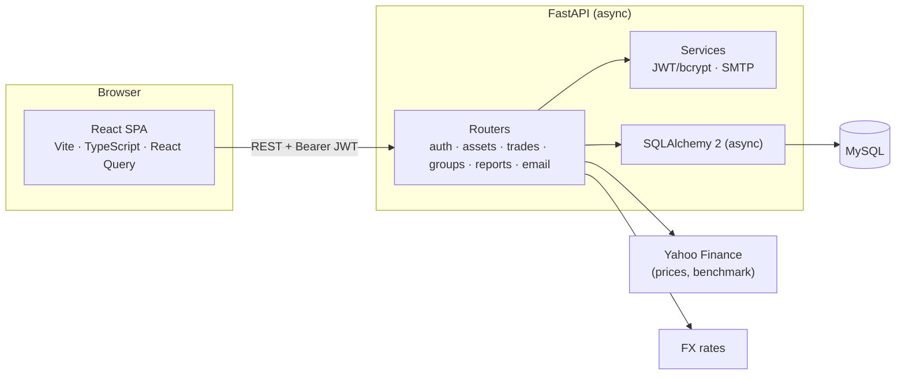

# Portfolio Dashboard

[](https://github.com/bhanu18/portfolio_tracker/actions/workflows/ci.yml)


[](backend/LICENSE)

A multi-currency stock, ETF and crypto portfolio tracker. Record trades, share portfolios with a group,
and see what your holdings are worth today in any currency — with FIFO cost basis and FX-adjusted returns.

<!-- Screenshots: add images to docs/screenshots/ and uncomment


-->

## Features

- **Assets** — stocks, ETFs, crypto and cash; live prices from Yahoo Finance with bulk refresh
- **Trades** — buys and sells in the asset's native currency, scoped to a group
- **Groups** — shared portfolios with per-group roles (admin / member) on top of global user roles
- **Valuation** — current value of any holding converted to a target currency
- **Performance report** — FIFO cost basis, unrealized gain/loss, annualized return, local vs. FX gain,
  breakdowns by currency and asset type, benchmark comparison and alpha
- **Auth** — JWT (OAuth2 password flow), registration, password change and email-based reset,
  rate-limited sensitive endpoints

## Architecture



```
portfolio_dashboard/
├── backend/          FastAPI, SQLAlchemy (aiomysql), Alembic, pytest
├── frontend/         Vite, React 18, TypeScript, React Query, axios
├── docs/             feature specs (reports, permissions, scoring)
└── .github/workflows CI for both apps
```

## Getting started

### Backend — http://localhost:8000 (interactive docs at `/docs`)

Requires **Python 3.12** and a MySQL database.

```bash
cd backend
uv venv venv --python 3.12 && source venv/bin/activate   # or: python3.12 -m venv venv
uv pip install -r requirements-dev.txt                   # or: pip install -r requirements-dev.txt
cp .env.example .env                                     # set DB URLs, SECRET_KEY, SMTP
alembic upgrade head                                     # migrations are not run on app start
uvicorn main:app --reload
```

> Python 3.14 fails to build `pydantic_core` / `watchfiles` with the pinned versions.

### Frontend — http://localhost:5173

```bash
cd frontend
npm install
cp .env.example .env    # VITE_API_BASE_URL=http://localhost:8000
npm run dev
```

Allowed frontend origins are configured with `CORS_ORIGINS` (comma-separated) in `backend/.env`.

## Quality checks

Everything below runs in GitHub Actions on every push and pull request.

| | Backend (`cd backend`) | Frontend (`cd frontend`) |
|---|---|---|
| Lint | `ruff check .` | `npm run lint` |
| Format | `ruff format .` | `npm run format` |
| Types | `mypy` | `npm run typecheck` |
| Tests | `pytest` (needs `TEST_DATABASE_URL`) | — |
| Build | `docker build -t portfolio-api .` | `npm run build` |

Pre-commit hooks run the linters and formatters before each commit:

```bash
pip install pre-commit && pre-commit install
pre-commit run --all-files
```

Tests run against a real MySQL database: the schema is created with Alembic once per session and every
test runs inside a transaction that is rolled back.

## Docker (backend)

```bash
cd backend
docker build -t portfolio-api .
docker run --env-file .env portfolio-api alembic upgrade head
docker run --env-file .env -p 8000:8000 portfolio-api
```

Health check: `GET /health` (reports database connectivity).

## Tech stack

**Backend:** Python 3.12 · FastAPI · SQLAlchemy 2 (async) · Alembic · Pydantic v2 · MySQL · python-jose ·
passlib/bcrypt · slowapi · yfinance · pandas · pytest · ruff · mypy

**Frontend:** React 18 · TypeScript · Vite · React Router · TanStack Query · axios · ESLint · Prettier
